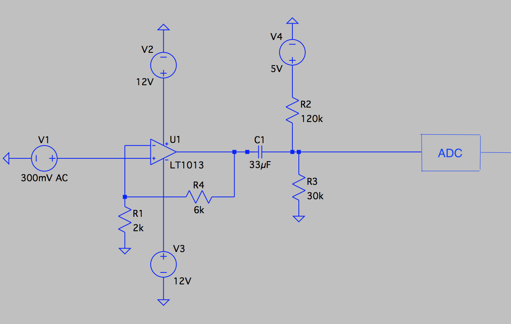

<!-- ⚠️ This README has been generated from the file(s) "blueprint.md" ⚠️-->
[](#guitar-delay-pedal)

# ➤ Guitar Delay Pedal

### Bryan Guner

### Table of Contents

---

**Introduction \_\_\_\_\_\_\_\_\_\_\_\_\_\_\_\_\_\_\_\_\_\_\_\_\_\_\_\_\_\_\_\_\_\_\_\_\_\_\_\_\_\_\_\_\_\_\_\_\_\_\_\_\_\_\_\_\_\_\_\_\_Page 2**

**Procedure\_\_\_\_\_\_\_\_\_\_\_\_\_\_\_\_\_\_\_\_\_\_\_\_\_\_\_\_\_\_\_\_\_\_\_\_\_\_\_\_\_\_\_\_\_\_\_\_\_\_\_\_\_\_\_\_\_\_\_\_\_\_\_Page 2**

**Design\_\_\_\_\_\_\_\_\_\_\_\_\_\_\_\_\_\_\_\_\_\_\_\_\_\_\_\_\_\_\_\_\_\_\_\_\_\_\_\_\_\_\_\_\_\_\_\_\_\_\_\_\_\_\_\_\_\_\_\_\_\_\_\_\_\_Page 4**

**Figure 1\_\_\_\_\_\_\_\_\_\_\_\_\_\_\_\_\_\_\_\_\_\_\_\_\_\_\_\_\_\_\_\_\_\_\_\_\_\_\_\_\_\_\_\_\_\_\_\_\_\_\_\_\_\_\_\_\_\_\_\_\_\_\_\_\_\_Page 4**

**Figure 2\_\_\_\_\_\_\_\_\_\_\_\_\_\_\_\_\_\_\_\_\_\_\_\_\_\_\_\_\_\_\_\_\_\_\_\_\_\_\_\_\_\_\_\_\_\_\_\_\_\_\_\_\_\_\_\_\_\_\_\_\_\_\_\_\_\_Page 5**

**Figure 3\_\_\_\_\_\_\_\_\_\_\_\_\_\_\_\_\_\_\_\_\_\_\_\_\_\_\_\_\_\_\_\_\_\_\_\_\_\_\_\_\_\_\_\_\_\_\_\_\_\_\_\_\_\_\_\_\_\_\_\_\_\_\_\_\_\_Page 5**

**Results\_\_\_\_\_\_\_\_\_\_\_\_\_\_\_\_\_\_\_\_\_\_\_\_\_\_\_\_\_\_\_\_\_\_\_\_\_\_\_\_\_\_\_\_\_\_\_\_\_\_\_\_\_\_\_\_\_\_\_\_\_\_\_\_\_\_Page 6**


[](#figure-4__________________________________________________________________page-6)

## ➤ **Figure 4\_\_\_\_\_\_\_\_\_\_\_\_\_\_\_\_\_\_\_\_\_\_\_\_\_\_\_\_\_\_\_\_\_\_\_\_\_\_\_\_\_\_\_\_\_\_\_\_\_\_\_\_\_\_\_\_\_\_\_\_\_\_\_\_\_\_Page 6**

### Introduction:

> The objective of this project is to design and create a guitar pedal to output a delayed and echoed input. Throughout this project, students will utilize experience in both software and hardware, such as MATLAB, PSoC Creator, and breadboard design. To create the delay effect of the pedal, the program will need to convert an analog guitar signal into a digital signal. Next, the program will continuously poll for updated digital input, and output the echoed sound.

### Procedure:

> The aim of  the project was to develop a guitar delay pedal that samples an analog signal via digital polling. In order to achieve the desired effect I decided to implement a FIR (Finite Impulse Response).  If you introduce an impulse, for example, a "1" sample followed by many "0" samples, the zeroes will arrive only after the "1" sample has made its way through the delay of the filter. The term finite impulse response arises because the filter output is computed as a weighted, finite term sum, of past, present, and future values of the guitar sample. A lack of feedback guarantees that the impulse response will be finite, however, in my case I  would like to feed the past values of the sample array back into the output for "n" number of echoes. AlthoughI have feedback in my filter, because the impulse response is finite, it is still considered a FIR. The delay pedal is a system in which the nth prior sample is subtracted (fed back) each time a new sample comes in. After an arbitrarily set number of samples of an impulse, the output will always be zero. To create the delay between impulses as described above,I stored my signal samples in an array of 20,000 elements and fed my echoes back using a circular buffer indexed by a variable dubbed "Windex". In order to port an analog guitar signal into the PSoC board where I  wish to manipulate it digitally, I  had to create a preamp stage circuit that both offset it so that it contained minimal negative voltage and amplified it from the mV range into the 1V range. This circuit consisted of an Op Amp to amplify, a 5V reference voltage in ratio with parallel resistors to offset and a capacitor to block unwanted DC phenomenon at the output. In addition,  I  also created a MATLAB program to simulate the FIR as a debugging resource, however this proved to be unnecessary as the device performed as expected albeit nearly momentarily. Once the guitar signal is digitally sampled and passed through the filtering delay, it is converted back to analog via the PSoC's on board resources and subsequently amplified.

Design:

        To create my guitar delay pedal, I  included numerous challenge elements, such as an analog to digital converter, a digital to analog converter, a FIR and two push buttons. I  initially implemented my design in LTSpice in order to and visualize my design.



> **Figure 1: LTSpice Circuit Schematic**

> Next, I  began the PSoC implementation of my design. The diagram below shows the communication between the ADC and DAC with the 20 kHz clock.


> **Figure 2:PSoC Schematic**

To demonstrate the functionality of my program, I  created a timing diagram. The diagram shows the timing relationships between the clock, the ADC, the "end of convert", the foreground program, and the VDAC. At the positive edge of the clock, the analog to digital conversion begins, and triggers my program to "begin". my guitar delay program will run, and finish with the conversion from digital to analog. The system will continue to run, always starting on the next positive edge of the clock. This diagram is shown below, in Figure 3.


> **Figure 3: Timing Diagram**


[](#results)

## ➤ Results:

This project served as an introduction to the capabilities of a PSoC board, and an opportunity to  utilize my knowledge in PSoC Creator to design a guitar delay pedal. The project enforced a strong conceptual understanding of a FIR, circular buffering, as well as polling via analog to digital conversion. Although my project produced no quantitative results, my delay pedal proved to be functional, further I  was able to demonstrate on an oscilloscope the relationship between the frequency of the input and the amplitude of its echo, however, this result was not captured before the untimely demise of my board. my design allowed the user to control the number of echoes produced by the pedal using two push buttons,either increment or decrement. The pedal was designed to be user friendly, and includes a LCD display which outputs the current number of echoes being produced. An image of my final project is shown below, in Figure 4.


**Figure 4: Final Delay Rectifier/Anti Aliasing Circuit**


[](#code)

## ➤ Code:

### C:

```C
int main()
{
  int maxs = 20000;
  int sum = 0;
  int windex = 0;
  volatile uint16_t n = 10;
  int delay = 2000;
  int k;
  uintl6_t x;
uint16_t gsa [20000]={0);                                                  //!sample array initialized to O
CyGlobalIntEnable;                                                         /* Enable global interrupts. */
Clock_l_Start();
ADC_SAR_1_Start();
VDAC8_1_Start();
LCD_Char_1_Start();
LCD_Char_l_Position(0u, 0u);
for (;;)
(
LCD_Char_l_ClearDisplay();
LCD_Char_l_PrintNumber(n);                                                        //!outputs n to display
CyDelay(500) ; if (Decrement_n_Read()==0)                                          //! if pressed
{
      CyDelay(500); //!to make sure increment/decrement event registers only once per press
      n = n - 1;    //!decrement
}
else it(increment_n_Read() == 0);
{
      CyDelay(500);
      n = n + 1; //!Increment
)
ADC_SAR_1_IsEndConversion(ADC_SAR_1_WAII_FOR_RESULT);                                         //!polling
x = ADC_SAR_l_GetResult16();
gsa[windex] - x; //!indexing sample array
sum = 0;
for (k = 0; k < n; ++k)
{
  sum += gsa[(windex + maxs - k * delay) % maxs]; //!circular buffer
)
sum-sum>>6;
sum = sum / n; //!Prevents increasing amplitude with every echo
VDAC8_l_SetValue(sum);
windex = (windex + l) % (maxs);
}
}


```

---


[](#matlab-code)

## ➤ Matlab Code:


#### Delay_model.m :

```r
FIFO ('init');
fs = 20000;
f0=440;
delay = 6000;
n_echos = 6;
x=(1:10*fs):
x=exp(-1.*x./2000).*cos(2*pi()*fs/f0*(1+x/100000).*x);
plot(x(1:1000))
%x(1000:end) = 0;
%sound(x)
1for n=1:20000 %assuming 10 seconds * 20,000
y(n)=Echo(x(n),delay,n_echos);
end
sound(y);
plot(y);


```


---

#### Echo.m:

```r
function y = Echo(x, delay, n_echos)
    sum = 0;
    FIFO('write', x);

    for i = 1:n_echos
        sum = sum + FIFO('read', delay * 1);
    end

    y = sum;
end


```


---

#### FIFO.m:

```r
function result = FIFO (command, arg)

    if strcmp(command, 'read')
        result = read_fifo(arg);
    else

        if strcmp(command, 'write')
            write_fifo(arg);
        else

            if strcmp(command, 'init')
                init_fifo();
            end

        end

    end

end

function init_fifo()
    global fifo_buf write_ptr MAX_DELAY; % globalizing variables
    MAX_DELAY = 20000; %Max delay of 20kHz
    fifo_buf = zeros(MAX_DELAY, 1); %buffer = array of all zeros
    write_ptr = 1;
end

function val = read_fifo(delay)% Val = fifo output
    global fifo_buf write_ptr MAX_DELAY;
    % Read delayed values
    % Delay read_ptr by an amount of samples, based on 'delay'
    read_ptr = mod((write_ptr — 2) — delay + MAX_DELAY, MAX_DELAY) + 1;
    val = fifo_buf(read_ptr);
end

function write_fifo(val)%using output of read_fifo
    global fifo_buf write_ptr MAX_DELAY;
    fifo_buf(write_ptr) = val;
    write_ptr = write_ptr + 1; %increment write_ptr by 1

    if (write_ptr > MAX_DELAY)%0nce write_ptr is greater than max delay, restart
        write_ptr = 1;
    end

end


```
